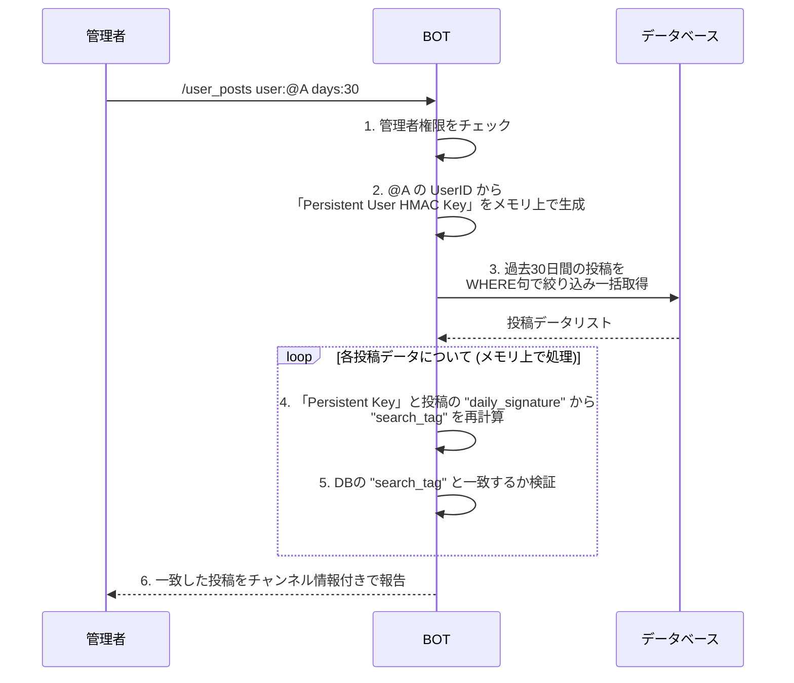

# ユーザーIDの暗号化・署名方式に関する技術仕様書

## 1. 目的と背景

### 1.1. 目的

本仕様の主な目的は、以下の3つの相反する要件を高いレベルで両立させることにあります。

1.  **ユーザーの匿名性の保護:** データベースが漏洩しても、投稿同士を長期的に紐付けることを困難にし、プライバシーを最大限に保護する。
2.  **管理者による追跡可能性の担保:** 管理者が必要な場合に限り、投稿者の身元特定 (`/trace`) や、投稿の長期的な一覧表示 (`/user_posts`) を可能にする。
3.  **機能要件の充足:** 同一チャンネル内での匿名IDの（日単位での）固定化や、レート制限などを実現する。

## 2. アーキテクチャ全体像：検索タグ方式

本システムは、「暗号化」「日次署名」「検索タグ」という3つの異なる識別子を組み合わせることで、複雑な要件を解決します。核心は**「データベース上には長期的な繋がりを直接保存せず、検索の時だけ動的に投稿を紐付ける」**という点にあります。

*   **`user_id_encrypted` (暗号化ID):** 管理者による身元特定 (`/trace`) 用。投稿ごとに**変動**し、マスターキーで**復号可能**。
*   **`daily_user_id_signature` (日次署名):** その日限りの匿名性を担保するためのID。**日付が変わると変動**し、**復号不可能**。
*   **`search_tag` (検索タグ):** 管理者による長期検索 (`/user_posts`) 用の特殊なタグ。投稿ごとに**変動**し、**復号不可能**。

```mermaid
graph TD
    subgraph "鍵生成フェーズ（メモリ上）"
        A[Master Key (.env)] --> B(PBKDF2)
        C[Guild Salt (DB)] --> B
        B --> D{Server Key}

        A --> E(PBKDF2)
        C --> E
        F[User ID] --> E
        G[Date] --> E
        E --> H{Daily User HMAC Key}

        A --> I(PBKDF2)
        C --> I
        F --> I
        I --> J{Persistent User HMAC Key}
    end

    subgraph "投稿フロー"
        F -- Server Key --> K(AES-GCM Encrypt)
        K --> L[user_id_encrypted]

        F -- Daily User HMAC Key --> M(HMAC-SHA256 Sign)
        M --> N[daily_user_id_signature]

        N -- Persistent User HMAC Key --> O(HMAC-SHA256 Sign)
        O --> P[search_tag]
    end

    subgraph "DB保存"
        L --> Q[AnonymousPosts Table]
        N --> Q
        P --> Q
    end
```

## 3. コンポーネント詳細

### 3.1. 鍵とソルト

*   **Master Key:** すべての鍵の源となるマスターシークレット。`.env` に `ENCRYPTION_KEY` として厳重に管理。
*   **Guild Salt:** サーバーごとにユニークなソルト。サーバー横断の追跡を防止。
*   **Server Key:** `Master Key` と `Guild Salt` から導出。`user_id` の暗号化・復号にのみ使用。
*   **Daily User HMAC Key:** `Master Key`, `Guild Salt`, `User ID`, **`Date`** から導出。日次署名の生成に使用。
*   **Persistent User HMAC Key:** `Master Key`, `Guild Salt`, `User ID` から導出。**DBには保存されず**、`/user_posts` 実行時にメモリ上でのみ生成され、`search_tag` の検証に使用される。

### 3.2. 投稿に記録される識別子

*   **`user_id_encrypted`:** 投稿ごとに変動する暗号化ID。`/trace` での復号による身元特定にのみ使用。
*   **`daily_user_id_signature`:** 日付が変わると変動する署名。同じ日の投稿の紐付けやレート制限に使用。復号は不可能。
*   **`search_tag`:** `Persistent User HMAC Key` を使って `daily_user_id_signature` にさらに署名したもの。投稿ごとに変動し、復号は不可能。`/user_posts` での長期検索の検証にのみ使用。

## 4. プロセス詳細

### 4.1. 投稿プロセス

1.  ユーザーが投稿すると、BOTは内部で `user_id` から以下の3つの値を生成する。
    1.  `encrypt(user_id)` → `user_id_encrypted`
    2.  `sign(user_id, date)` → `daily_user_id_signature`
    3.  `sign(daily_user_id_signature, persistent_key)` → `search_tag`
2.  これら3つの値を `AnonymousPost` テーブルに保存する。

### 4.2. 管理者による投稿者特定 (`/trace`)

1.  対象投稿の `user_id_encrypted` をDBから取得。
2.  `decrypt(user_id_encrypted)` を実行し、元の `user_id` を復号して管理者に提示。

### 4.3. 管理者によるユーザー投稿検索 (`/user_posts`)

管理者のみが実行可能なコマンド。

#### 4.3.1. コマンド仕様

*   **形式:** `/user_posts user:<対象ユーザー> [options...]`
*   **オプション:**
    *   **期間指定:** `days:<日数>` (デフォルト: 30, 上限: 90) または `start_date`/`end_date` で指定。
    *   **チャンネル指定:** `channel:<#チャンネル>` (デフォルト: サーバー全体)
    *   **削除状態:** `deleted_status:<active_only|deleted_only|all>` (デフォルト: `active_only`)

#### 4.3.2. 処理フロー



## 5. データベーススキーマへの影響

*   **`AnonymousPost` テーブル:**
    *   `user_id_signature` カラムを `daily_user_id_signature` (String 128) に変更。
    *   `search_tag` (String 128) カラムを新設。

*   **`GuildBannedUser`, `BotBannedUser` テーブル:**
    *   `user_id_signature` カラムを廃止し、`user_id` (String 30) を直接保存する。

*   **`BotLog` テーブル:**
    *   BOTの動作ログを記録するためのテーブル。
    *   `level` (ログレベル), `message` (ログメッセージ), `created_at` (作成日時) などのカラムを持つ。

*   **削除されたテーブル:**
    *   `BotActionLog`, `BotSettings`, `ConfigBackup` テーブルは、新しいログシステムへの移行に伴い不要となったため削除されました。

## 6. セキュリティとパフォーマンス

### 6.1. データベース漏洩時の安全性

本アーキテクチャは、`.env` にある `Master Key` が安全である限り、データベースが漏洩してもユーザーの長期的な匿名性を保護します。攻撃者は投稿ごとにバラバラな `daily_user_id_signature` と `search_tag` のペアしか得られず、それらを紐付ける `Persistent User HMAC Key` はDBに存在しないため、ユーザーの活動を追跡することは極めて困難です。

### 6.2. パフォーマンス

`/user_posts` の検索処理は、以下の設計によりパフォーマンスを確保します。

*   **N+1問題の回避:** 最初に1回の `SELECT` クエリで対象期間のデータを一括取得し、その後の検証はすべてメモリ上で行うため、追加のクエリは発生しません。
*   **検索範囲の限定:** 期間指定（デフォルト30日/上限90日）を設けることで、一度に処理するデータ量を現実的な範囲に保ち、応答速度を確保します。

## 7. ログ管理

### 7.1. ファイルログ

*   **通常ログ (NLOG):** `log/NLOG.log` に保存されます。INFOレベル以上のすべてのログが記録されます。
*   **エラーログ (ELOG):** `log/ELOG.log` に保存されます。ERRORレベル以上のログのみが記録されます。
*   **ローテーション:**
    *   ログファイルは毎日深夜0時にローテーションされます。
    *   古いログは `log/archive/` ディレクトリに `YYYYMMDD_` のプレフィックス付きで移動されます。
    *   アーカイブされたログは7日間保持された後、自動的に削除されます。

### 7.2. データベースログ

*   **テーブル:** `bot_logs`
*   **記録内容:** ファイルログと同様に、すべてのログがデータベースにも記録されます。
*   **ローテーション:** 1年以上経過したログは、毎日自動的にデータベースから削除されます。
*   **閲覧:** BOTオーナーは `/view_logs` コマンドを使用して、データベースに記録されたログを閲覧できます。