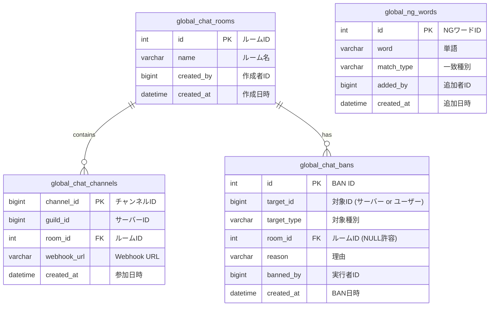
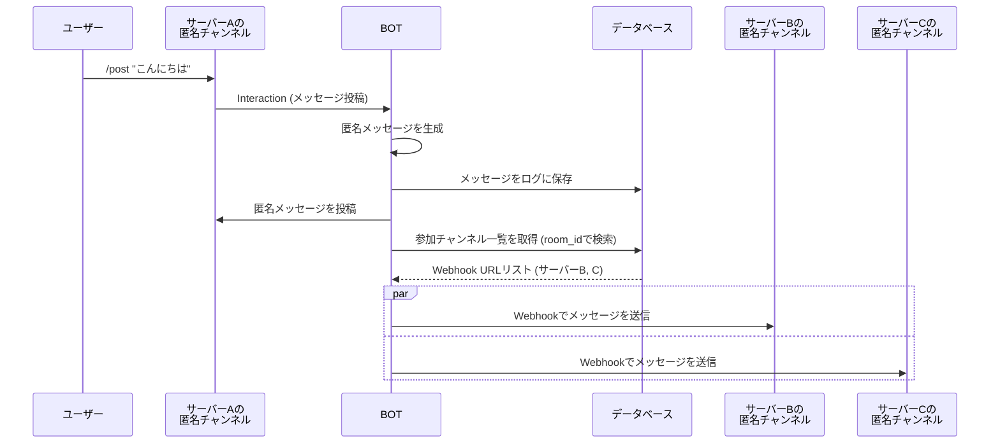
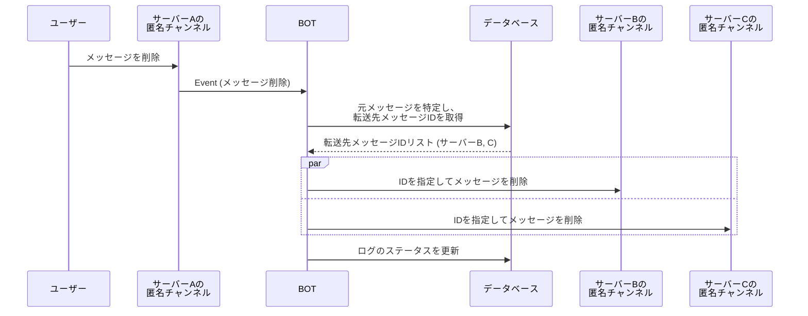

# 匿名グローバルチャット機能 仕様書

## 1. 概要

本ドキュメントは、Discord匿名BOTに新しく実装する「匿名グローバルチャット機能」の仕様を定義するものである。
この機能により、BOTが導入されている複数のDiscordサーバー間で、匿名メッセージをリアルタイムに共有することが可能になる。

### 1.1. 基本的な仕組み

- BOTオーナーは、複数の「グローバルチャットルーム」を作成できる。
- 各サーバーの管理者は、自身のサーバーの特定のチャンネルを、いずれかのグローバルチャットルームに参加させることができる。
- あるルームに参加しているチャンネルで匿名投稿（`/post` コマンド、または誤投稿変換）が行われると、その内容はWebhookを利用して、同じルームに参加している他の全てのサーバーのチャンネルに転送される。
- メッセージの更新・削除も同様に、参加している全てのチャンネルに即時反映される。

## 2. 機能一覧

### 2.1. 一般ユーザー向け機能

- グローバルチャットが有効なチャンネルで `/post` コマンドを使用してメッセージを投稿する。
- 投稿したメッセージを削除する。

### 2.2. サーバー管理者向け機能

- サーバーのチャンネルをグローバルチャットルームに参加させる。
- サーバーのチャンネルをグローバルチャットルームから退出させる。
- 参加可能なグローバルチャットルームの一覧を表示する。

### 2.3. BOTオーナー向け機能

- グローバルチャットルームを作成・削除する。
- 全てのグローバルチャットルームの一覧を表示する。
- 特定のサーバーをグローバルチャットルーム、または全グローバルチャット機能からBANする。
- 特定のサーバーをグローバルチャットルームから強制的に退出させる。
- グローバルNGワードを登録・管理する。
- 全てのグローバルチャットのログを閲覧する。

## 3. コマンド体系

### 3.1. サーバー管理者向けコマンド

| コマンド | 説明 | 引数 | 権限 |
| --- | --- | --- | --- |
| `/gcr join` | チャンネルをグローバルチャットルームに参加させます。 | `room`: 参加するルーム名（選択式） | サーバー管理者 |
| `/gcr leave` | チャンネルをグローバルチャットルームから退出させます。 | なし | サーバー管理者 |
| `/gcr list` | 現在参加しているグローバルチャットを一覧表示します。 | なし | サーバー管理者 |

### 3.2. BOTオーナー向けコマンド

| コマンド | 説明 | 引数 | 権限 |
| --- | --- | --- | --- |
| `/gcr create` | 新しいグローバルチャットルームを作成します。 | `name`: ルーム名 | BOTオーナー |
| `/gcr delete` | グローバルチャットルームを削除します。 | `room`: 削除するルーム名（選択式） | BOTオーナー |
| `/gban server` | サーバーをグローバルチャットからBANします。 | `server_id`: 対象サーバーID `room_id`: (任意)対象ルームID `reason`: (任意)理由 | BOTオーナー |
| `/gcr kick` | サーバーをルームから強制退出させます。 | `server_id`: 対象サーバーID `room_id`: (任意)対象ルームID `reason`: (任意)理由 | BOTオーナー |
| `/gngword add` | グローバルNGワードを追加します。 | `word`: NGワード `match_type`: 一致種別（完全一致, 部分一致, 正規表現） | BOTオーナー |
| `/gngword remove` | グローバルNGワードを削除します。 | `word`: 削除するNGワード | BOTオーナー |
| `/gngword list` | 登録されているグローバルNGワードを一覧表示します。 | なし | BOTオーナー |
| `/ban` | (既存コマンド拡張) ユーザーをBANします。 | `user_id`: 対象ユーザーID `global`: (任意)TrueでグローバルBAN | サーバー管理者 (ローカル), BOTオーナー (グローバル) |

## 4. データベース設計

### 4.1. ER図

### 4.2. テーブル定義

- **global_chat_rooms**
  - グローバルチャットのルーム情報を管理する。
- **global_chat_channels**
  - 各ルームに参加しているチャンネルの情報を管理する。`webhook_url` を保持し、メッセージ転送に使用する。
- **global_chat_bans**
  - BAN情報を管理する。`target_type` に 'SERVER' または 'USER' を格納する。`room_id` が NULL の場合は、全ルームからのBANを意味する。
- **global_ng_words**
  - グローバルNGワードを管理する。`match_type` に 'EXACT', 'PARTIAL', 'REGEX' を格納する。

## 5. メッセージフロー

### 5.1. メッセージ投稿シーケンス

### 5.2. メッセージ削除シーケンス

## 6. その他仕様

- **ログ**: ログの参照範囲は、原則として自サーバーで投稿されたもののみ。BOTオーナーはオプションですべてのログを閲覧可能。BOTオーナーが `trace` や `user_posts` コマンドで他サーバーの投稿を閲覧する場合、サーバー名、チャンネル名、ルーム名などの追加情報が表示される。
- **NGワード**: 投稿時、まず投稿元サーバーのローカルNGワードをチェックし、次にグローバルNGワードをチェックする。いずれかに抵触した場合、投稿はブロックされる。
- **制限事項**:
  - フォーラムチャンネルはグローバルチャットに参加できない。
  - グローバルチャットが有効なチャンネルではスレッド作成コマンドは実行できない。
  - グローバルチャットで共有されるのは匿名投稿のみ。